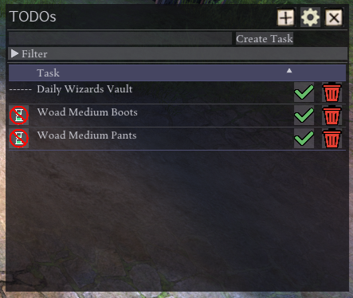
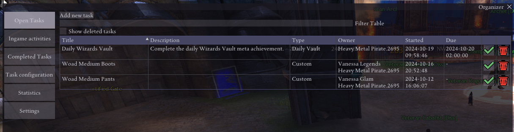
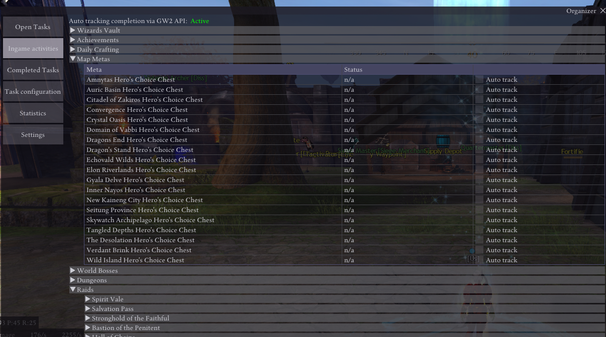
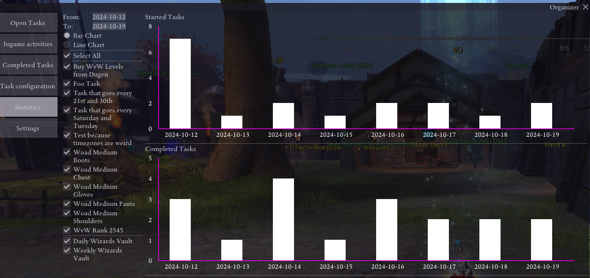

# GW2 Organizer

Ever felt like you're losing track of your daily routine? Well, no longer because Organizer is here!

### Features
- a To Do list to always have your current goals in view
- notifications for your deadlines and play dates
- statistics about how well you are doing in your endeavors
- ability to create repeating schedules so you never miss a raid again
- integration into the GW2 API

 

## Installation
Organizer is being distributed via the Nexus addons catalogue. Just click "install" and you're ready to go!

## Note
Organizer is in Open Beta. There might still be some features that are not working as expected but the bulk has been tested in an exhaustive development phase over at ⁠addon-requests . If you encounter any issues still or have ideas to make it a more user friendly experience, let me know in the comments below!

## Setup
Once installed and loaded, you will find a little new icon on your top bar. Left-clicking will automatically open the ToDos, while right clicking offers some more options to get directly into the configurations and settings.

If you plan on just using it as a simple list to tick off, that's all you'll ever need. However, if you are looking for more advanced stuff like schedules, tracking and auto-completing tasks ingame (like daily crafts, metas and many more) you will need some extra configurations, all accessible from the "Configurations" window found right-clicking the icon or clicking the cog-button in the ToDos list:

## API & auto tracking ingame activities
In the Settings tab you may configure a GW2 API key. The minimum required permissions to enable all current features are
- account: this is the default permission with all keys
- characters: allows the addon to read your characters names, races and professions; the character name may be used for some completion checks on tasks
- progression: allows the addon to read progression on various tasks such as raid completions in the current lockout period, current wizards vault state or achievement completions; this data is being used to automatically tick off tasks that can be tracked with the API

Once configured, under the "Ingame activities" tab there's a wide selection of tasks available that can be tracked (more or less) automatically. Enabling tracking means that you will be presented with a new task at the appropriate interval (daily, weekly at the server reset times) whenever you have no task of that type open.

Note: the GW2 API always lags a bit behind, mostly by about 5 minutes. Also, your daily progress will carry over to the next day until you log in for the first time. In order to avoid false completion of tasks, auto tracking will only enable after a grace period after loading the addon. This is being indicated in the header of the "Ingame activities" tab.
Schedules

You have created an entry to your ToDo list that you want to have on repeat? No problem, there's multiple ways to achieve this:
- in the ToDo list you can find a button with an hour glass next to the task name - clicking this button allows you to swiftly change the interval at which this task will appear
- in the "Task configuration" tab you can edit configurations using the blue button with a pencil - this allows you to change intervals amongst other properties of a task

The settings "daily" and "weekly" will put the due date of a task to the next corresponding server reset time, enabling you to easily keep track if you did that activity in the current or previous reset.

If you need a more fine grained solution to your task schedule, the "custom" option is your friend. This setting allows you to set up tasks to appear on specific days of week or months, with a given due date. So for example you could set up a task "Raid Night!" that would be created every Thursday for 8p.m., or a task "Hydrate" for every 1st, 10th and last of a month. In general there is a lot of flexibility in how you can set up tasks with that setting. Due to this nature, trying to set up "custom" intervals from the quick access will open the configuration window.

Note that scheduled tasks work on a subscription base. This means that if you want them to appear, you will have to actively subscribe to them by clicking the bell button. If you ever want to pause a subscription, you can do so by cancelling at the same spot. This allows you not just to have your schedules on you whenever you need them, but also if you are an alt-oholic to be able to pick which accounts might get a task or skip on.

## Notifications
Under the "Settings" tab you can set up whether you wanna be notified about an upcoming due date so you can never lose track of what's about to come.

## Data retention
By default,  Organizer will never forget what you did last summer. But what if that is a bit too excessive for you? 

Worry not, the Settings tab has something for you. Configuring a grace period to delete tasks will automatically remove states for tasks fitting the following description:
- completed tasks: if the completion date is [X] days since today
- deleted/trashed tasks: if the begin date is [X] days since today

But even if you remove a single task execution, its settings will prevail so you can restart the tasks whenever you feel like. If you also wanna get rid of the configuration too, you can put the checkmark for that. The same goes for subscription based configurations - even if no one is subscribed, they will sit around for a while. If you want subscriptionless configurations to also be removed, you can check that off too.

## Statistics
Organizer has a little statistics page that keeps track of how many tasks you started and completed in a given timespan. The statistics also let you filter for separate task types so you can easily keep track of when you forgot that one daily you swore to always do.

